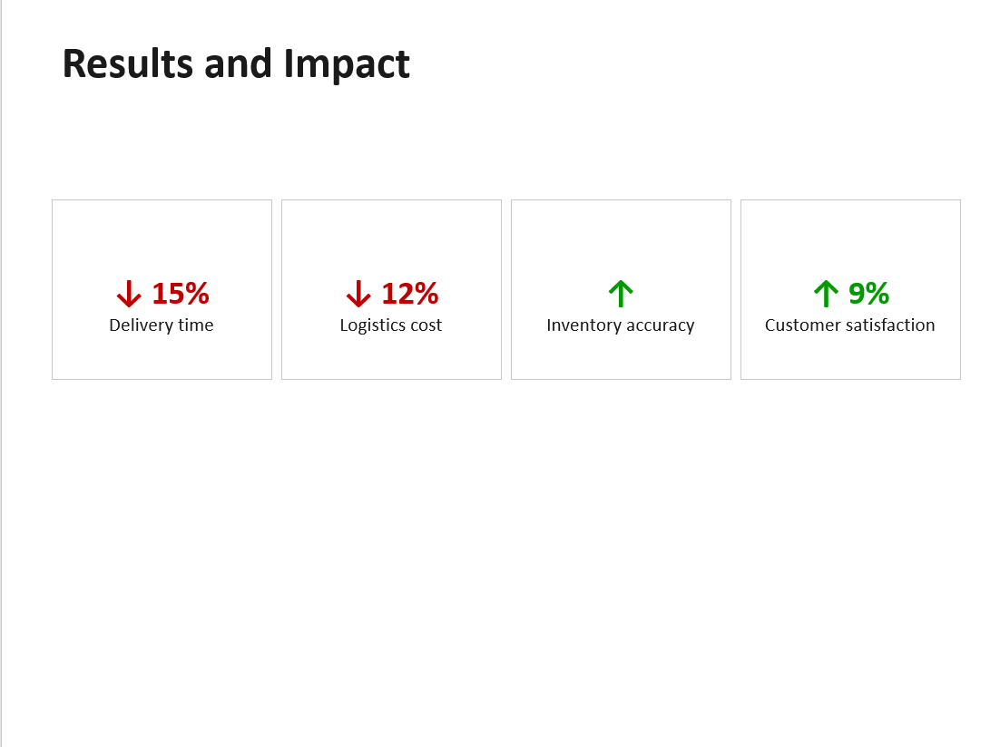

# Amazon Data Analytics Case Study

**Author:** Sergey Krichevsky  
**Course:** GenerativeAI (Developers Institute, 2025)  
**Project Type:** Case Study Presentation  
**Topic:** Real-world application of data analytics in business operations  

---

## 📌 Project Overview

This project is a case study presentation analyzing how **Amazon** used data analytics and machine learning in 2024 to optimize its logistics network. It was developed as part of a data analytics module in the *GenerativeAI* course and also serves as a professional showcase of applied analytical thinking and business communication.

---

## 🎯 Objective

- Demonstrate the **real-world impact** of data analytics on business operations.
- Answer key academic questions:
  1. What role did data analysis play in the outcome?
  2. What would have been different without it?
- Present the findings in a concise, visual, and professional format.
- Use the presentation as a **sample deliverable** for data consulting or AI-based analytics services.

---

## 🏢 Case Context — Amazon (2024)

In response to rising logistics costs and increasing demand for fast delivery, **Amazon** implemented a large-scale analytics and machine learning system to:

- Predict demand more accurately  
- Optimize delivery routes  
- Improve warehouse coordination  
- Reduce costs and delays  

Sources: Reuters, Bloomberg, CNBC (Mar–Apr 2024)

---

## 🔍 Data Analyzed

- Historical delivery route data  
- Customer behavioral data  
- Weather and traffic datasets  
- Warehouse inventory and flow  
- Financial performance metrics  

---

## 🧠 Methods Used

- Machine Learning for demand forecasting  
- Route clustering based on efficiency  
- Regression analysis to evaluate key factors  
- A/B testing of logistics strategies  
- Real-time dashboards for operational oversight  

---

## 📈 Results and Outcomes

- 🚚 Delivery time reduced by **15%**  
- 💰 Logistics costs reduced by **12%**  
- 📦 Inventory accuracy improved significantly  
- 😊 Customer satisfaction increased by **9%**

---

## 🧩 Key Takeaways

- **Without analytics:** Higher costs, inefficient routing, lower customer satisfaction  
- **With analytics:** Smarter, predictive, and agile logistics network  
- **Conclusion:** Data analytics is not just a tool — it’s a competitive advantage

---

## 📁 Repository Structure

```plaintext
📁 presentation/
   └── Amazon_Case_Study_Final_Complete.pptx
   └── Amazon_Case_Study_Final_Complete.pdf
README.md
``` 

## 🖼️ Slide Preview



👉 [Click here to view the full presentation (PPTX)](presentation/Amazon_Case_Study_Final_Complete.pptx)